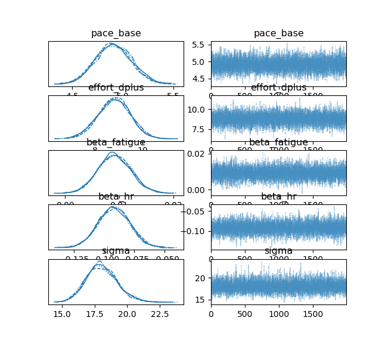
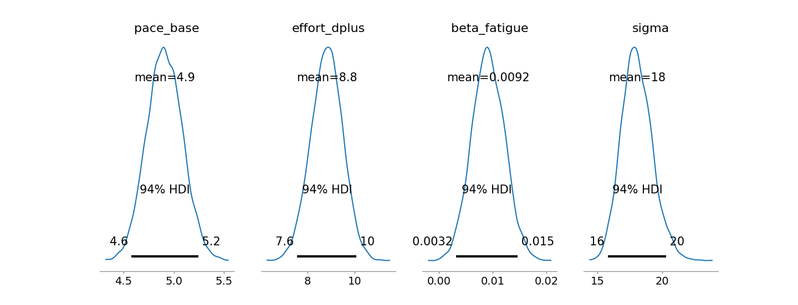
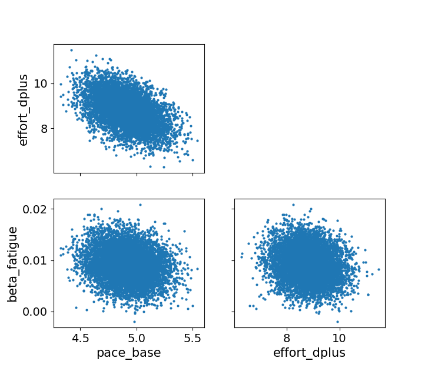

# Trail Time Predictor

Bayesian model to predict trail running times using your Strava data.

## What it does

Uses PyMC to fit a model with base pace, elevation cost, fatigue factor, and heart rate adjustment. Then predicts your finish time for a given distance/elevation.

## Setup

```bash
python3.11 -m venv venv311
source venv311/bin/activate
pip install pymc arviz pandas matplotlib
```

Needs Python 3.11 (PyMC doesn't work with 3.14 yet).

## Run

```bash
python3.11 mcmc.py
```

Edit `d_target` and `d_plus_target` in the script to change your race parameters.

## Data

Put your Strava export in `data/activities.csv`. Needs columns: `type`, `moving_time`, `distance`, `total_elevation_gain`, `average_heartrate`.

## Results





